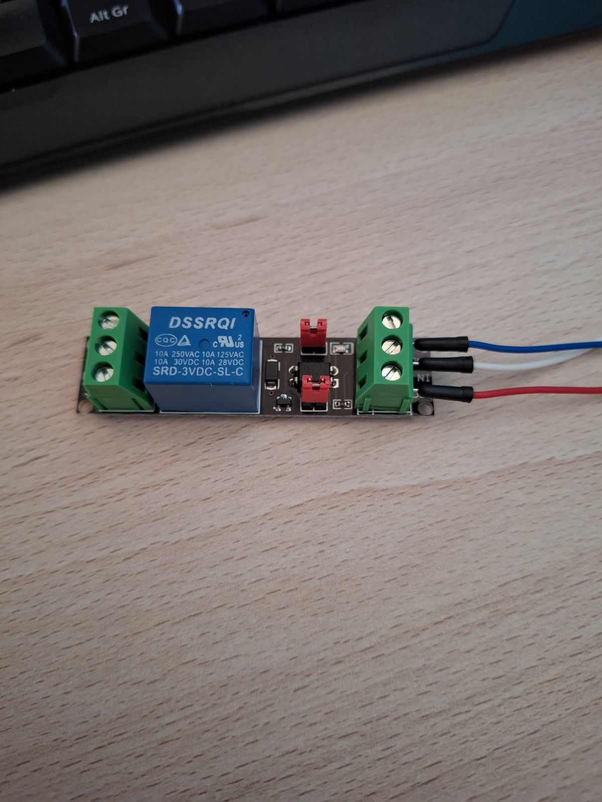

**Objetivo en el proyecto**
Nuestro objetivo es utilizar dos ESP32 con un sensor de luminosidad en cada uno, estas placas se colocaran en dos ubicaciones de la clase para medir el nivel de luz en cada punto, estas dos placas harán un promedio para decidir si encender las luces o mantenerlas apagadas, Ejp: Si el promedio de ambas placas supera los 100 lux la luz se mantendrá apagada, en cambio si es menor a 100lux se encenderan las luces, todo esto se medirá cada 60 segundos, esto ayudará a que haya una visión clara en el aula.

**¿Como lo vamos a hacer?**
Tendremos dos ESP32 y cada uno tendrá un medidor de lúmenes cada uno, el primer sensor (que será el proincipal) mostrará la cantidad de lúmenes que recibe su sensor, y estará escuchando conectada mediante MQTT al sensor secundario, esperando a recibir datos para mostrarlos con los datos del primer sensor. El segundo sensor recibirá los lúmenes y los enviará a la ESP32 principal mediante MQTT.

Para que se haga más efectivo, mediremos el promedio de ambos sensores y si la cantidad de lúmenes supera una cierta cantidad, encendemos la luz para una mejor vision, para que esto funcione conectaremos un relé a la ESP32 principal.

**Lista de dispositivos en el kit**

**-Placa ESP32**


Se trata de un microcontrolador que integra tecnologías WiFi y Bluetooth, que le proporcionan conectividad con internet u otros dispositivos.


**-Placa desarrollo para ESP32**


Es una tarjeta de desarrollo WIFI/Bluetooth, tiene las mismas características que otras placas ESP32 y se puede programar con microPython, LUA y Arduino IDE. Se puede alimentar mediante MicroUSB.


**-Sensor de iluminación BH1750**


El sensor de iluminación es un sensor digital de luz ambiental que mide la intensidad lumínica en lux.


**-Módulo de relé optoacoplador 3V**



Este módulo sirve para controlar todo tipo de electrodomésticos y dispositivos de carga de alta corriente como ventiladores funcionando como un interruptor activado mediante la luz emitida por un diodo red.


**Descarga y configuracion de Arduino IDE**
- Nos dirigimos a https://www.arduino.cc/en/software
- Descargamos la version linux ZIP
- Descomprimimos y ejecutamos el archivo "arduino-ide"
- Una vez abierto el IDE en la esquina superior izquirda pulsamos "Select other board and port"
- Instalamos la extension esp32
- Buscamos y seleccionamos ESP32 Dev Module y a la derecha nos aparecera el puesto al que tenemos conectada la ESP32. Tras seleccionar le damos a "OK"


**Conexiónes**

ESP32 Principal


ESP32 Secundaria


  **Mediciones de luz**
Promedio de iluminacion de los 2 sensores

| Estado de luz   | Persianas Abiertas | Persianas Cerradas |
|----------------|-------------------|-------------------|
| Luz encendida  | 130               | 48                |
| Luz apagada    | 107               | 21                |


**Automatización de la iluminación de clase**
Para automatizar la iluminacion utilizaremos 2 sensores de luz conectado a su propia ESP32 en diferentes zonas de la clase para una mayor efectividad.

La ESP32 principal recibirá los datos de luz de su sensor y de un sensor secundario y dependiendo del nivel de luminosidad de las distintas zonas encenderá o apagará el relé.

```ccp
#include <WiFi.h>
#include <PubSubClient.h>
#include <BH1750.h>
#include <Wire.h>

#define WIFI_SSID "2DAW_IoT"
#define WIFI_PASSWORD "Somos2DAW"
#define MQTT_SERVER "192.168.100.101"
#define MQTT_PORT 1883
#define MQTT_USER "mqtt"
#define MQTT_PASSWORD "mqtt"
#define MQTT_TOPIC "g1/rele"

#define RELAY_PIN 13  // Pin donde está conectado el relé

BH1750 sensor;
WiFiClient espClient;
PubSubClient client(espClient);

int luxSecundaria = 0;  // Almacena la lectura de la ESP32 secundaria

void callback(char* topic, byte* payload, unsigned int length) {
  Serial.print("Mensaje recibido en el topic: ");
  Serial.println(topic);

  String luxStr = "";
  for (int i = 0; i < length; i++) {
    luxStr += (char)payload[i];
  }
  
  luxSecundaria = luxStr.toInt();  // Convertir a entero
  Serial.print("Nivel de luz de ESP32 secundaria: ");
  Serial.println(luxSecundaria);
}

void reconnect() {
  while (!client.connected()) {
    Serial.print("Conectando a MQTT...");
    if (client.connect("ESP32_Principal", MQTT_USER, MQTT_PASSWORD)) {
      Serial.println("Conectado a MQTT");
      client.subscribe(MQTT_TOPIC);
    } else {
      Serial.print("Error, rc=");
      Serial.print(client.state());
      Serial.println(" Intentando de nuevo en 2 segundos...");
      delay(2000);
    }
  }
}

void setup() {
  Serial.begin(115200);
  Wire.begin();
  
  if (!sensor.begin(BH1750::CONTINUOUS_HIGH_RES_MODE)) {
    Serial.println("Error al iniciar el sensor BH1750");
    while (1);  // Detener el programa si el sensor no se inicia correctamente
  }

  pinMode(RELAY_PIN, OUTPUT);
  digitalWrite(RELAY_PIN, LOW);  // Asegurar que el relé está apagado al inicio

  // Conectar WiFi
  WiFi.begin(WIFI_SSID, WIFI_PASSWORD);
  while (WiFi.status() != WL_CONNECTED) {
    delay(1000);
    Serial.print(".");
  }
  Serial.println("\nConectado a WiFi");

  // Configurar MQTT
  client.setServer(MQTT_SERVER, MQTT_PORT);
  client.setCallback(callback);
  reconnect();
}

void loop() {
  if (!client.connected()) {
    reconnect();
  }
  client.loop();

  // Leer nivel de luz local
  float luxPrincipal = sensor.readLightLevel();
  Serial.print("Nivel de luz ESP32 Principal: ");
  Serial.println(luxPrincipal);

  // Promedio de ambas mediciones
  int luxPromedio = (luxPrincipal + luxSecundaria) / 2;
  Serial.print("Nivel de luz promedio: ");
  Serial.println(luxPromedio);

  // Control del relé
  if (luxPromedio < 105) {
    digitalWrite(RELAY_PIN, HIGH);  // Encender el relé si no hay suficiente luz
  } else if (luxPromedio > 130) {
    digitalWrite(RELAY_PIN, LOW);  // Apagar si hay poca luz
  }

  delay(5000);
}

```

La ESP32 secundaria recibirá los datos de luz de su sensor y los enviará a la ESP32 principal que controla el relé
```ccp
#include <WiFi.h>
#include <PubSubClient.h>
#include <BH1750.h>
#include <Wire.h>

#define WIFI_SSID "2DAW_IoT"
#define WIFI_PASSWORD "Somos2DAW"
#define MQTT_SERVER "192.168.100.101"
#define MQTT_PORT 1883
#define MQTT_USER "mqtt"
#define MQTT_PASSWORD "mqtt"
#define MQTT_TOPIC "g1/rele"

BH1750 sensor;
WiFiClient espClient;
PubSubClient client(espClient);

void reconnect() {
  while (!client.connected()) {
    Serial.print("Conectando a MQTT...");
    if (client.connect("ESP32_Secundaria", MQTT_USER, MQTT_PASSWORD)) {
      Serial.println("Conectado a MQTT");
    } else {
      Serial.print("Error, rc=");
      Serial.print(client.state());
      Serial.println(" Intentando de nuevo en 2 segundos...");
      delay(2000);
    }
  }
}

void setup() {
  Serial.begin(115200);
  Wire.begin();
  
  if (!sensor.begin(BH1750::CONTINUOUS_HIGH_RES_MODE)) {
    Serial.println("Error al iniciar el sensor BH1750");
    while (1);  // Si falla, detener el programa
  }

  // Conectar WiFi
  WiFi.begin(WIFI_SSID, WIFI_PASSWORD);
  while (WiFi.status() != WL_CONNECTED) {
    delay(1000);
    Serial.print(".");
  }
  Serial.println("\nConectado a WiFi");

  // Configurar MQTT
  client.setServer(MQTT_SERVER, MQTT_PORT);
  reconnect();
}

void loop() {
  if (!client.connected()) {
    reconnect();
  }
  client.loop();

  // Leer el nivel de luzclient.publish(MQTT_TOPIC, luxStr);
  float lux = sensor.readLightLevel();
  Serial.print("Nivel de luz placa Secundaria: ");
  Serial.println(lux);

  // Convertir el valor a string antes de enviarlo por MQTT
  char luxStr[10];
  dtostrf(lux, 6, 2, luxStr);
  client.publish(MQTT_TOPIC, luxStr);

  delay(2000);
}

```
