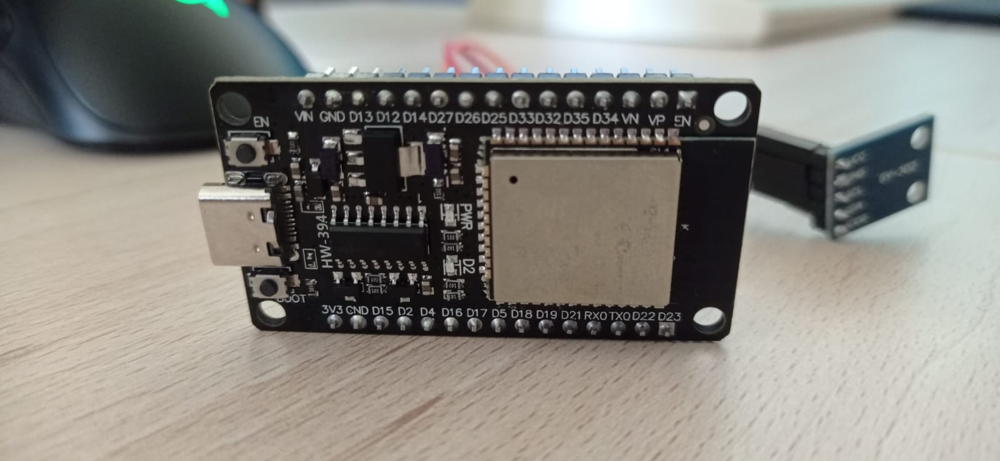
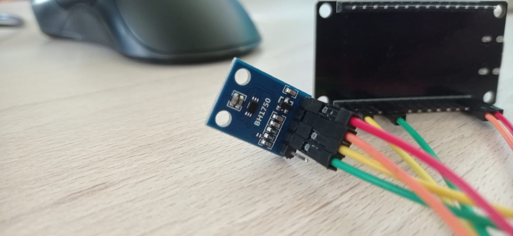
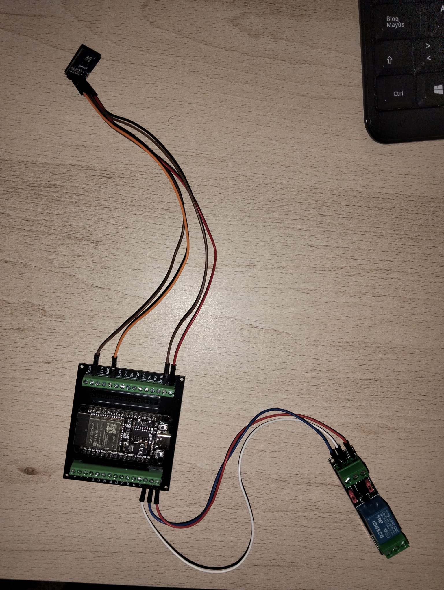
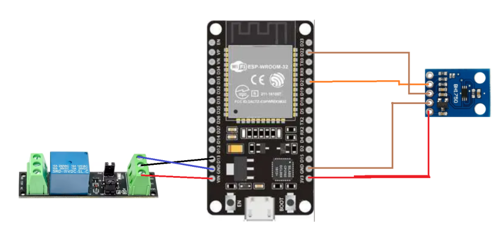
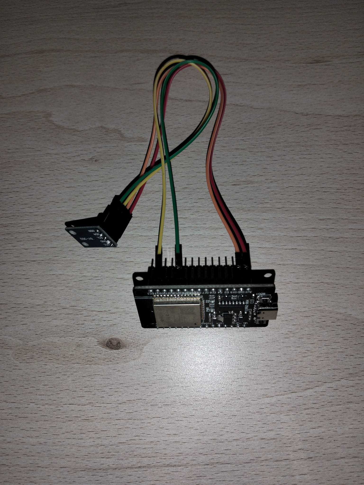
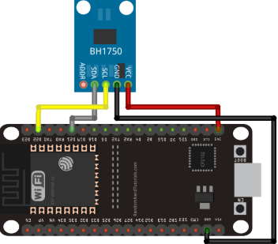
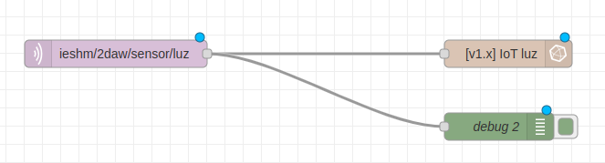
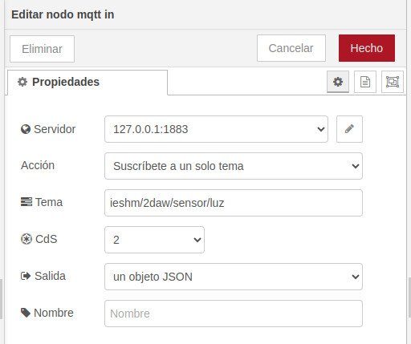
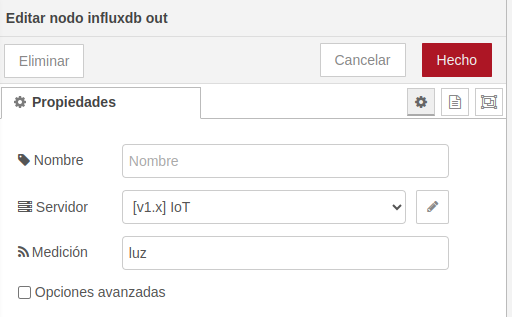
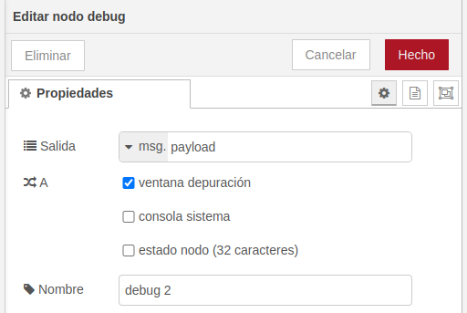

# Objetivo en el proyecto
Vamos a usar dos ESP32 con sensores de luminosidad para medir la luz en diferentes puntos de un aula. Ambas placas calcularán un promedio de iluminación y decidirán si encender o apagar las luces automáticamente.

**¿Como lo vamos a hacer?**
- Cada ESP32 tiene un sensor de luz y mide los lúmenes en su ubicación.
- El ESP32 principal recibe los datos del ESP32 secundario mediante MQTT.
- Se calcula el promedio de ambas mediciones cada 60 segundos.
- Reglas de encendido/apagado de luces:
 * Si el promedio supera 100 lux, las luces permanecen apagadas.
 * Si es menor a 100 lux, las luces se encienden automáticamente.
- Un relé conectado al ESP32 principal controlará el encendido y apagado de las luces.

# Dispositivos usados en el proyecto

**-Placa ESP32**



Se trata de un microcontrolador que integra tecnologías WiFi y Bluetooth, que le proporcionan conectividad con internet u otros dispositivos.


**-Placa desarrollo para ESP32**


Es una tarjeta de desarrollo WIFI/Bluetooth, tiene las mismas características que otras placas ESP32 y se puede programar con microPython, LUA y Arduino IDE. Se puede alimentar mediante MicroUSB.


**-Sensor de iluminación BH1750**



El sensor de iluminación es un sensor digital de luz ambiental que mide la intensidad lumínica en lux.


**-Módulo de relé optoacoplador 3V**


Este módulo sirve para controlar todo tipo de electrodomésticos y dispositivos de carga de alta corriente como ventiladores funcionando como un interruptor activado mediante la luz emitida por un diodo red.

# Descarga y configuracion de Arduino IDE
- Nos dirigimos a https://www.arduino.cc/en/software
- Descargamos la version linux ZIP
- Descomprimimos y ejecutamos el archivo "arduino-ide"
- Una vez abierto el IDE en la esquina superior izquirda pulsamos "Select other board and port"
- Instalamos la extension esp32
- Buscamos y seleccionamos ESP32 Dev Module y a la derecha nos aparecera el puesto al que tenemos conectada la ESP32. Tras seleccionar le damos a "OK"

# ESP32 Principal  
## Conexiónes  

Para esta placa conectaremos el sensor de luminosidad BH1750 a la ESP32 mediante las siguientes conexiones:

| BH1750   | ESP32 |
|----------------|-------------------|
| VCC  | 3V3               |
| GND  | GND               |
| SCL  | D22               |
| SDA  | D21               |

A continuacion conectaremos el relé a la ESP32 mediante las siguientes conexiones:

| Relé   | ESP32 |
|----------------|-------------------|
| VCC  | VIN               |
| IN   | D13               |
| GND  | GND               |

**Foto de las conexiones**




**Programacion de la placa**  

Si solo vamos a tener un sensor de luminosidad usaremos este codigo
```ccp
#include <BH1750.h>
#include <Wire.h>

BH1750 sensor;

void setup() {
  // put your setup code here, to run once:
  Wire.begin();
  sensor.begin();
  Serial.begin(115200);
}

void loop() {
  // put your main code here, to run repeatedly:
  unsigned int lux = sensor.readLightLevel();
  Serial.print("Nivel: ");
  Serial.print(lux);
  Serial.println(" lx");

if (lux < 105) {
    digitalWrite(RELAY_PIN, HIGH);  // Encender el relé si no hay suficiente luz
  } else if (lux > 130) {
    digitalWrite(RELAY_PIN, LOW);  // Apagar si hay poca luz
  }
  delay(1000);
}

```

En el caso de que queramos tener mas de un sensor la ESP32 principal recibirá los datos de luz de su sensor y de un sensor secundario y dependiendo del nivel de luminosidad de las distintas zonas encenderá o apagará el relé.

```ccp
#include <WiFi.h>
#include <PubSubClient.h>
#include <BH1750.h>
#include <Wire.h>

#define WIFI_SSID "(nombre de tu red)"
#define WIFI_PASSWORD "(contraseña de la red)"
#define MQTT_SERVER "(ip de tu servidor)"
#define MQTT_PORT 1883
#define MQTT_USER "(usuario de mqtt)"
#define MQTT_PASSWORD "(contraseña del usuario de mqtt)"
#define MQTT_TOPIC "g1/rele"

#define RELAY_PIN 13  // Pin donde está conectado el relé

BH1750 sensor;
WiFiClient espClient;
PubSubClient client(espClient);

int luxSecundaria = 0;  // Almacena la lectura de la ESP32 secundaria

void callback(char* topic, byte* payload, unsigned int length) {
  Serial.print("Mensaje recibido en el topic: ");
  Serial.println(topic);

  String luxStr = "";
  for (int i = 0; i < length; i++) {
    luxStr += (char)payload[i];
  }
  
  luxSecundaria = luxStr.toInt();  // Convertir a entero
  Serial.print("Nivel de luz de ESP32 secundaria: ");
  Serial.println(luxSecundaria);
}

void reconnect() {
  while (!client.connected()) {
    Serial.print("Conectando a MQTT...");
    if (client.connect("ESP32_Principal", MQTT_USER, MQTT_PASSWORD)) {
      Serial.println("Conectado a MQTT");
      client.subscribe(MQTT_TOPIC);
    } else {
      Serial.print("Error, rc=");
      Serial.print(client.state());
      Serial.println(" Intentando de nuevo en 2 segundos...");
      delay(2000);
    }
  }
}

void setup() {
  Serial.begin(115200);
  Wire.begin();
  
  if (!sensor.begin(BH1750::CONTINUOUS_HIGH_RES_MODE)) {
    Serial.println("Error al iniciar el sensor BH1750");
    while (1);  // Detener el programa si el sensor no se inicia correctamente
  }

  pinMode(RELAY_PIN, OUTPUT);
  digitalWrite(RELAY_PIN, LOW);  // Asegurar que el relé está apagado al inicio

  // Conectar WiFi
  WiFi.begin(WIFI_SSID, WIFI_PASSWORD);
  while (WiFi.status() != WL_CONNECTED) {
    delay(1000);
    Serial.print(".");
  }
  Serial.println("\nConectado a WiFi");

  // Configurar MQTT
  client.setServer(MQTT_SERVER, MQTT_PORT);
  client.setCallback(callback);
  reconnect();
}

void loop() {
  if (!client.connected()) {
    reconnect();
  }
  client.loop();

  // Leer nivel de luz local
  float luxPrincipal = sensor.readLightLevel();
  Serial.print("Nivel de luz ESP32 Principal: ");
  Serial.println(luxPrincipal);

  // Promedio de ambas mediciones
  int luxPromedio = (luxPrincipal + luxSecundaria) / 2;
  Serial.print("Nivel de luz promedio: ");
  Serial.println(luxPromedio);

  // Control del relé
  if (luxPromedio < 105) {
    digitalWrite(RELAY_PIN, HIGH);  // Encender el relé si no hay suficiente luz
  } else if (luxPromedio > 130) {
    digitalWrite(RELAY_PIN, LOW);  // Apagar si hay poca luz
  }

  delay(5000);
}

```


# ESP32 Secundaria  
En el caso en el queramos tomar mediciones en mas de un sitio tendremos que conectar una segunda placa ESP32 la cual tendremos que configurar también.  

## Conexiones  

En la ESP32 secundaria solo conectaremos un sensor de luminosidad BH1750 con las mismas conexiones que antes:

| BH1750   | ESP32 |
|----------------|-------------------|
| VCC  | 3V3               |
| GND  | GND               |
| SCL  | D22               |
| SDA  | D21               |

**Foto de las conexiones**
  



**Programacion de la placa**  
La ESP32 secundaria recibirá los datos de luz de su sensor y los enviará a la ESP32 principal que controla el relé
```ccp
#include <WiFi.h>
#include <PubSubClient.h>
#include <BH1750.h>
#include <Wire.h>

#define WIFI_SSID "(nombre de tu red)"
#define WIFI_PASSWORD "(contraseña de la red)"
#define MQTT_SERVER "(ip de tu servidor)"
#define MQTT_PORT 1883
#define MQTT_USER "(usuario de mqtt)"
#define MQTT_PASSWORD "(contraseña del usuario de mqtt)"
#define MQTT_TOPIC "g1/rele"

BH1750 sensor;
WiFiClient espClient;
PubSubClient client(espClient);

void reconnect() {
  while (!client.connected()) {
    Serial.print("Conectando a MQTT...");
    if (client.connect("ESP32_Secundaria", MQTT_USER, MQTT_PASSWORD)) {
      Serial.println("Conectado a MQTT");
    } else {
      Serial.print("Error, rc=");
      Serial.print(client.state());
      Serial.println(" Intentando de nuevo en 2 segundos...");
      delay(2000);
    }
  }
}

void setup() {
  Serial.begin(115200);
  Wire.begin();
  
  if (!sensor.begin(BH1750::CONTINUOUS_HIGH_RES_MODE)) {
    Serial.println("Error al iniciar el sensor BH1750");
    while (1);  // Si falla, detener el programa
  }

  // Conectar WiFi
  WiFi.begin(WIFI_SSID, WIFI_PASSWORD);
  while (WiFi.status() != WL_CONNECTED) {
    delay(1000);
    Serial.print(".");
  }
  Serial.println("\nConectado a WiFi");

  // Configurar MQTT
  client.setServer(MQTT_SERVER, MQTT_PORT);
  reconnect();
}

void loop() {
  if (!client.connected()) {
    reconnect();
  }
  client.loop();

  // Leer el nivel de luzclient.publish(MQTT_TOPIC, luxStr);
  float lux = sensor.readLightLevel();
  Serial.print("Nivel de luz placa Secundaria: ");
  Serial.println(lux);

  // Convertir el valor a string antes de enviarlo por MQTT
  char luxStr[10];
  dtostrf(lux, 6, 2, luxStr);
  client.publish(MQTT_TOPIC, luxStr);

  delay(2000);
}

```

  **Mediciones de luz**
Promedio de iluminacion de los 2 sensores

| Estado de luz   | Persianas Abiertas | Persianas Cerradas |
|----------------|-------------------|-------------------|
| Luz encendida  | 130               | 48                |
| Luz apagada    | 107               | 21                |


#Automatizacion con Node-RED y Home Assistant

##Node-RED

**Esquema Node-RED**


**Configuracion mqtt in**


**Configuracion InfluxDB**


**Configuracion Debug**


